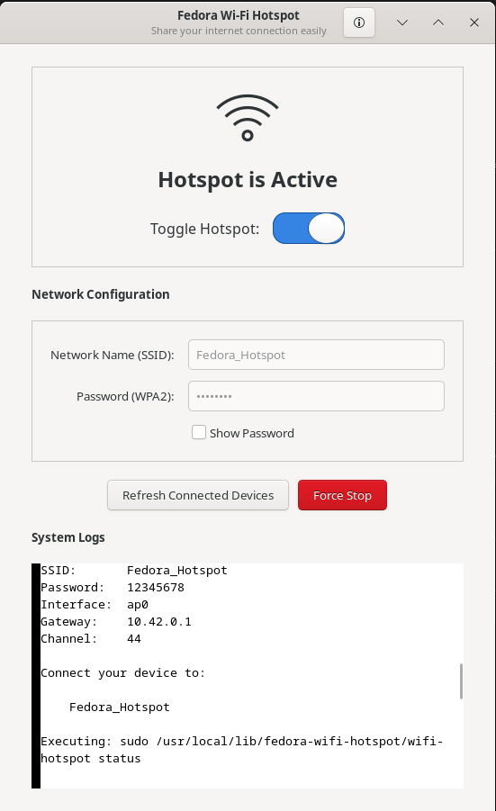

<div align="center">
  <h1>🚀 Fedora Wi-Fi Hotspot</h1>
  <p><b>A powerful, lightweight, and modern Wi-Fi hotspot tool for Fedora Linux.</b></p>
  
  
  
  
</div>

<br>

<!-- 
Keywords / SEO: Fedora Wi-Fi Hotspot, Linux Access Point, Create Hotspot Fedora, Share Wi-Fi Linux, Concurrent AP Client, hostapd GUI, dnsmasq GUI, GNOME Wi-Fi Hotspot.

Tip for Repo Owner: Don't forget to add these tags in your GitHub repository's "About" section topics: fedora, wifi-hotspot, linux-networking, gtk3-python, access-point.
-->

`fedora-wifi-hotspot` empowers your Fedora system to share its existing Wi-Fi or Ethernet internet connection through a software access point (hotspot) using your wireless adapter.

With the brand-new **Native GNOME GUI**, managing your hotspot has never been easier or more beautiful!

---

<div align="center">
  <h3>✨ The Modern GUI ✨</h3>
  <!-- ADD YOUR GUI SCREENSHOT IMAGE HERE -->
  
  
</div>

---

## 🌟 Key Features

- **Beautiful Native GUI**: A fully-fledged GTK GNOME application built specifically for Fedora, featuring one-click toggles and real-time connection monitoring.
- **Concurrent Client + AP**: Share your Wi-Fi connection using the *same* wireless adapter without dropping your internet connection (hardware permitting).
- **Passwordless Execution**: Securely integrates with `sudoers` and `pkexec` so you never have to type your password to start the hotspot.
- **Smart Hardware Detection**: Automatically detects Wi-Fi interfaces, PHY, driver capabilities, channel, and frequency.
- **Rock-Solid Backend**: Powered by `hostapd` for WPA2 security, `dnsmasq` for rapid DHCP IP allocation, and `nftables` for secure firewall routing and NAT.

---

## 🛠️ Installation

**The easiest way to install is via the pre-packaged Release!**

1. Go to the [Releases page](https://github.com/ha-re-ram/fedora-wifi-hotspot/releases/latest) and download the `.tar.gz` file.
2. Extract the downloaded folder and open a terminal inside it.
3. **Run the Installer:**
   ```bash
   sudo ./install.sh
   ```

The automated installer will download all required dependencies (`hostapd`, `dnsmasq`, etc.), install the command-line tool, copy the GUI into your system applications, and configure passwordless access.

---

## 🚀 How to Use

### Method 1: The Graphical Interface (Recommended)
1. Press the **Super (Windows) key** to open your Fedora Application Launcher.
2. Search for **"Fedora Wi-Fi Hotspot"**.
3. Launch the app! 
4. Configure your Network Name (SSID) and Password, and simply flip the switch to turn the hotspot on.

### Method 2: Command Line (CLI)
You can also run everything directly from the terminal from anywhere on your system.

**Start the hotspot:**
```bash
wifi-hotspot start --ssid "My Hotspot" --password "MyPassword123"
```

**Check the status:**
```bash
wifi-hotspot status
```

**Stop the hotspot:**
```bash
wifi-hotspot stop
```

---

## ⚠️ Hardware Limitations & DFS Channels

Not every Wi-Fi adapter is physically capable of broadcasting a hotspot while simultaneously connected to a Wi-Fi network.

### The Radar Restriction (`DFS start_dfs_cac() failed, -1`)
If you are connected to a 5GHz DFS channel (e.g. Channel 116), you may encounter a failure when starting the hotspot. By international law, devices broadcasting on DFS channels must actively scan for weather/military radar (DFS Master mode). Most consumer Wi-Fi cards physically lack this hardware certification. 

Because single-radio cards cannot broadcast on a different channel than the one they are connected to, the **only physical solutions** are:
1. Connect your laptop's main Wi-Fi to a **2.4GHz network** or a non-DFS 5GHz network.
2. Plug your laptop into the internet via an **Ethernet cable**, completely freeing up the Wi-Fi radio.

---

## 🗺️ Roadmap

- [x] Create a native Fedora GTK GUI.
- [x] Implement robust background process handling.
- [ ] **Web UI Dashboard**: A planned web-based dashboard (using Node.js/Vite) to manage your hotspot remotely from any connected device!
- [ ] Expanded hardware compatibility reporting and bypasses.

---

## 🤝 Contributing

We welcome all contributions! Whether it's adding new features, fixing bugs, or improving documentation, we'd love your help.

1. **Fork** the repository on GitHub.
2. **Clone** your fork locally.
3. **Create a branch** for your feature (`git checkout -b feature/AmazingFeature`).
4. **Commit** your changes (`git commit -m 'Add some AmazingFeature'`).
5. **Push** to the branch (`git push origin feature/AmazingFeature`).
6. **Open a Pull Request**!

When reporting bugs, please include the output of `wifi-hotspot diagnose` and `iw dev` (make sure to hide any sensitive passwords!).

---

## 📝 License

This project is licensed under the [MIT License](LICENSE).

<div align="center">
  Made with ❤️ by <a href="https://github.com/shubhamcoder260">shubhamcoder260</a> & <a href="https://github.com/ha-re-ram">ha-re-ram</a>.
</div>
